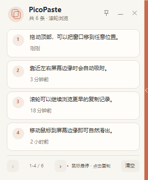

# PicoPaste

一个自用的 Windows 小剪贴板。没有复杂功能，主要就是贴在屏幕边缘，随手复制一点东西。



## 下载

[直接下载最新版 PicoPaste.exe](https://github.com/Xiaoc7r/clipboard/releases/latest/download/PicoPaste.exe)

单文件，下载后直接运行，不需要安装。Windows 10 / 11 可用。

## 能做什么

- 吸附在屏幕左侧或右侧，平时自动藏起来
- 默认贴在屏幕右侧，鼠标移到边缘就会滑出
- 鼠标离开后自动收起，主要操作都可以只用鼠标完成
- 保存最近 40 条文本，一次显示 4 条
- 点击卡片立即复制，并给出轻量反馈
- `Shift + P` 也可以快速呼出或收起
- 支持拖动、跨屏、置顶、锁定展开和托盘运行
- 默认使用轻微半透明效果

## 关于性能

PicoPaste 使用原生 WinForms，没有常驻鼠标轮询。待机时主要等待系统剪贴板和鼠标事件，短动画只在展开、收起或点击时运行。

历史记录最多 40 条，单条文本和总文本量都有上限，写盘也做了合并处理。目标很简单：旧电脑挂着用也没什么感觉。

## 自己编译

项目只用系统自带的 .NET Framework WinForms，没有第三方依赖：

```powershell
powershell -ExecutionPolicy Bypass -File .\build.ps1
```

编译结果在 `dist\PicoPaste.exe`。

设置和历史记录保存在 `%LocalAppData%\PicoPaste`。

## 其他

就是个人自用项目，想到什么再慢慢加。代码随便看看。

